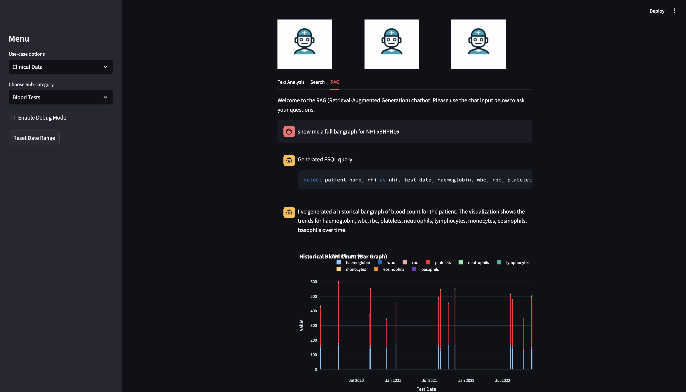

### Disclosure: 

This healthcare demo uses fictitious names and data for educational purposes only. Neither Elastic nor the creator of this demo are responsible for any misuse or misinterpretation of the information presented. This demo is not intended for medical advice or decision-making. All content is for demonstration and learning purposes exclusively.


### Requirements: 
- python 3.12 and pip
- A working OpenAI API key
- A running Elastic Cloud and a working API key
- *IMPORTANT*: Update the .env 


### Key notes:
The following python files have --help arguments available. So its very help explanatory. Assuming the ES cloud, ES API, and OpenAI API key are already ready. The next workflow are as follows:

1. Create an index
2. Build a pipeline
3. Install a model, (depending with the demo)
4. Generate simulated blood PDF file
5. Upload the PDF file to ES. (This is to showcase that you can ingest PDF in Elastic)
6. Create clinical notes in ES.


```
0-install-required-models.py
1-generate-blood-report.py
2-upload-blood-report.py
3-generate-and-upload-clinical-report.py

```


#### Demo requirements

1. Clone this github
   ```
   git clone <this repo>
   ```

2. Install the required python 3.12 module
  ```
  pip install -r requirements.txt
  ```

3. Install the MODELS, this may take sometime. 
   ```
   python 0-install-required-models.py
   ```


### Text Analysis:
Once you performed #3 from the above instructions, you can test this straigh away.  

Sample inputs:
* NER - "My name is Banjo from Philippines, and I work for Elastic"
* Sentiment Analysis - "I feel a little awesome today, but my co-worker is having a bad day"
* Zero Shot - "Please help! I'm running out of battery"

### RAG: 
To perform the RAG demo with actionable insights:

1. Generate a simulated blood report
  ```
  python 1-generate-blood-report.py --patients 15 --samples 5 --start-year 2020 --end-year 2022 --percentage-min 5 --percentage-max 10 --to-pdf --output-dir ./reports
  ```

3. Create a pipeline and index

  ```
  python 2-upload-blood-report.py --create-pipeline 
  python 2-upload-blood-report.py --create-index
  ```

3. Upload the PDF reports to your ES instance
  ```
  python 2-upload-blood-report.py --folder reports/
  ```


##### Prompts you can try
1. show me a patient and their NHI number
2. show me a full blood count *table* of NHI <number>
3. I need a wbc, rbc, platelets *bar chart* for NHI <number>
4. Provide a blood count *line chart* for <patient name>
5. I need a full blood count *scatter chart* for NHI <number>

###: Search
###### To do the Keyword, ELSER, and Hybrid Demo

```
1. Create index
   python 3-generate-and-upload-clinical-report.py --create-index
2. Create pipeline
   python 3-generate-and-upload-clinical-report.py --create-pipeline
3. Generate clinical data demo
   python 3-generate-and-upload-clinical-report.py --input-csv list_conditions.txt
```
